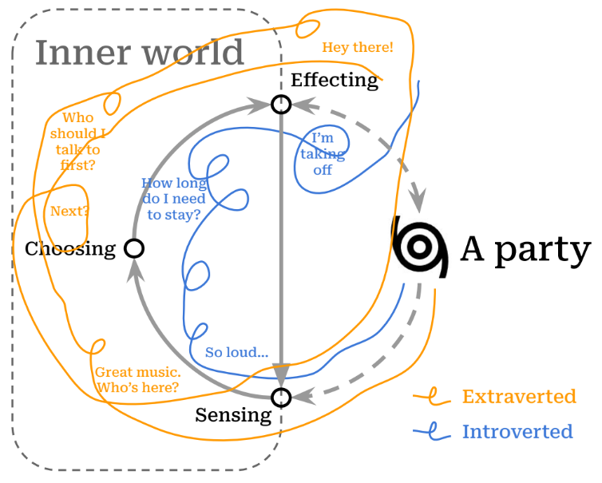

```{r message=FALSE, warning=FALSE, echo = FALSE}
library(tidyverse); library(readxl)
knitr::opts_chunk$set(echo = F, warning = F, message = F)
```


The days revolve.  I wake again into myself.  I walk the familiar orbit of habits and tensions tracing back to my childhood.  To my parents, to their childhoods. And so on.  *Life is a circle.*  
    
The days slip away.  I will never see yesterday again, and I'm continually tiptoe on the verge of an undiscovered moment.  *Life is a line.*  
    
Circle, line: these are partial figures we've often fused together to depict our experience, since neither seems adequate by itself.  Change is possible, but the new grows from the old.  Each adult is formed from the body of a child.  Tomorrow I will still be me, but I can unlock the closed cycle of my habits and choose what is good.  Recognizable, but transformed. *Life is a spiral*.
    
Preparing myself, I shuffle the small deck of questions I've nearly worn out with partial answers:  [Who am I?](#who) [What do I want to become?](#what) [How do I change myself?](#how)  There's no reason to listen to my slow rehearsal, except that the answers are not mine: they're a playlist of other, lovely voices.

## Who am I? {#who}

### A Little World in Motion

"*I am a little world made cunningly / Of elements and an angelic sprite*" writes John Donne,^[See [Holy Sonnet 5](https://www.poetryfoundation.org/poems/44108/holy-sonnets-i-am-a-little-world-made-cunningly)] gesturing toward our smallness and our vastness, our physicality and what is intangible in us.  Even that intangible part of us seems to be composed of reflections: ^[As one of Donne's contemporaries notes, the "*mind a mirror is of heavenly sights, / A brief wherein all marvels summed lie*".  See [Look Home](https://www.poetry.com/poem/31924/look-home) by Robert Southwell.] though there is one reality, we each walk around in our "own worlds" and participate in each others' "worlds".  

This cycle weaving together inner and outer worlds depicts a dance that has been engaged by philosophies and religions across cultures and ages: Atman and Brahman^[अयम् आत्मा ब्रह्म
*ayam ātmā brahma*, roughly translated "the self is connected to the deep foundation of reality", from the [Brihadaranyaka Upanishad 4.4.5](https://archive.org/details/Brihadaranyaka.Upanishad.Shankara.Bhashya.by.Swami.Madhavananda/page/712/mode/2up). The Upanishads also include the notion that all creatures are connected to this deep foundation, (सर्वं खल्विदं ब्रह्म, *sarvam* *khalvidam* *brahma*), see [Chandogya Upanishad 3.14.1](https://archive.org/details/upanishads01ml/page/48/mode/2up)], the knower and the known, I and Thou [@buberThou2000], the individual soul and the Empyrean^[For Dante, entering heaven can be seen as approaching this unity between self and other: "*In this flash of insight, all “I”s are one: each is everything and nothing. This was the revelation experienced by Moses on Mount Sinai, which prompted him to tell the Israelites: “I AM sent me to you.”*". [@moevsMetaphysicsDanteComedy2005], p. 31].

It is also founded in our biology, our bodies.  In *A Foray into the Worlds of Animals and Humans*, @jakobvonuexkullForayWorldsAnimals2010 describes how the internal world of any organism, including humans, is made up.  He names this subjective world an Umwelt (*surroundworld*) since it is focused outward, created and reshaped by each of us when we interact with reality. This cycle shows how it works in action:

{width=80%}

The beauty of the Umwelt model is that it explains a lot, and simply. It pares down the bewildering array of experience into two realms: *inside* of me, and *outside* of me. In it, all experiences are shown as pathways between the inner world and outer reality: the narrow routes by which we *sense* the outer world (coming in), and by which we *affect* it (going out).

Staggering and complex as our experiences are, they move through us along this pathway.  But the path is not a closed circle, endlessly playing the same loop over and over again: it's a spiral.  The world changes, and calls me to change.  Sunsets may be the same as when I was a kid, but I *sense* them differently.  I change myself, and even the vast world, a little bit at a time.

The spiral, that elegant fusion of circle and line, acknowledges repetition while allowing transformation.  And it's worth noting that I can change for better or for worse, which we acknowledge when we talk about a *vicious cycle* (or its more recent sibling, the *virtuous cycle*).^[While it seems that early usage of 'vitious cycle' goes [back to 1608](https://english.stackexchange.com/questions/375811/origin-of-vicious-circle-and-vicious-cycle), both terms began to be used more widely only in the 20th century, [according to Google Ngram Viewer](https://books.google.com/ngrams/graph?content=virtuous+cycle%2Cvicious+cycle&year_start=1800&year_end=2019&corpus=en-2019&smoothing=0)]  A spiral is vicious when it closes me off into an inner world which becomes antagonistic to others.  It is virtuous when it beckons me out to gather and learn from the world beyond, in order to share with others.

The world rushes in and I have a choice, moment-by-moment, day-after-day.  If a little change is possible each time I move through this cycle, then a question presents itself: what is the shape I want to make?  

As a prelude to answering that question, it may help to look around and ask: what are some of the the shapes that people trace as they experience the world, make choices, and act on them?

<!-- I am not a closed loop.  Everything that I experience (each kiss, each poem, each peach) is just a segment of a fuller circle: each of my actions a gesture out into an immense world.   And the world is too great for me to control (*thus the diagram's dotted lines*), so that just to exist requires much going right (luck, fortune, or grace, whatever one calls it).  A person cannot be walled off, so we are continually vulnerable: open to the world outside ourselves and depending on it.   -->

### Same Difference
  
No one else has the same story as me.  Down to the spelling of my genetic code, I'm unique.  But others' stories resonate with me.  Even my body is written with the same language as yours: we're the same.

The collection of traits that my family, friends and colleagues recognize as 'me' describe patterns of interactions they've had with me.  Those patterns are the various ways that I interact with the world, and they're basically my unique remix of the kinds of interactions that others have with the world.

Over time, people have attempted to classify the ways in which humans interact with the world, from the ancient models of the *four humors*^[Echoes of this model come down into modern science, as in the work of Hans Eysenck (1916–97). "If one crosses Eysenck’s extraversion–introversion dimension with the emotional stability emotional lability dimension, four cells emerge that correspond to the Greek model of Hippocrates and Galen", according to @dumontHistoryPersonalityPsychology2010] or the *triguna*^[For a crosswalk of Indian Ayurvedic models and modern psychology, see: @srivastavaConceptPersonalityIndian2012] to modern neuropsychology.  One of the more recent versions of this effort has resulted in trait models of personality. ^[[@dumontHistoryPersonalityPsychology2010], p. 150]  A trait is a repeated pattern which guides how a person interprets the flow of sensations and reacts to them.  For example, if I typically react to the flow of sensations from a crowded party with enthusiasm, I'm engaging a trait that we call *extraversion*.  If I shy away from asserting myself at the party, I'm exhibiting the flipside of that trait (i.e. *introversion*).

{width=80%}

Beginning with the available stock of phrases available in our speech and writing, researchers have tested whether the various descriptions we apply to each other can be distilled to a handful of common traits transcending cultures and languages.  This way, descriptions such as "she is dutiful" and "she is diligent" and "she is detail-oriented" could all be seen as pointing to an underlying character trait of "conscientiousness."  These researchers have found five or maybe six basic dimensions which explain the incredible variety of personalities that we encounter in others.^[The two most popular trait models are known as the Five-Factor Model (FFM) and HEXACO.  The FFM uses the acronym OCEAN as a mnemmonic for the traits: *Openness to Experience*, *Conscientiousness*, *Extraversion*, *Agreeableness*, and *Neuroticism*.  HEXACO itself is an acronym, and adds an additional trait of *Honesty-Humility* to the other five, which it renames as: *Emotionality*, *eXtraversion*, *Agreeableness* (versus Anger), *Conscientiousness*, and *Openness to Experience*.]

If these 'word-based' attributes point to something real about us, it would be strange if we could not trace their presence within the fabric of our bodies. And so we have dug deeper, and neurological studies of the brain [@alkalayBiologicalBasisFFM2022] have found relationships between our longstanding descriptions of ourselves, and the material structures of our bodies: the brain and other nerves that weave our bodies together.

The furthest distillation of personality traits finds two basic tendencies: *stability* and *plasticity*.^[For the original study deriving these meta-traits from a community survey, see: [@deyoungHigherorderFactorsBig2006]. Later studies such as [@alkalayBiologicalBasisFFM2022], indicate that *stability* is based in the FTI Serotonin system (i.e. cautious/norm compliant), while *plasticity* is based in the dopamine and related norepinephrine system (i.e. curious/energetic).] A motion which holds us together, and a motion that impels us to explore the world.  A circle and a line.

{width=80%}

The table above shows how these two tendencies play out across the five factors of personality, as well as the essential aspects [@deyoungFacetsDomains102007] of each of those factors.  There are many more descriptions clustered under each of these, but this gives a sense of the space in which our temperaments situate themselves.

```{r eval=FALSE, include=FALSE}

# https://ipip.ori.org/newIndexofScaleLabels.htm

traits <- read_excel("data/TedoneItemAssignmentTable30APR21.xlsx") 

factors <- traits %>% filter(instrument == "NEO5-20")

tst <-
  factors %>%
  select(text, factor = label, key) %>%
  left_join(
    traits %>% 
      filter(instrument != "NEO5-20") %>% 
      select(text, aspect = label),
    by = "text"
  ) %>%
  filter(key == 1)

```


## What do I want to become? {#what}

## How do I change myself? {#how}

