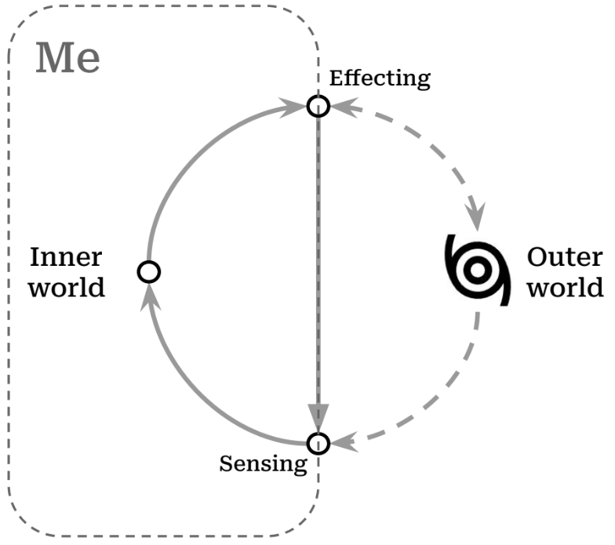
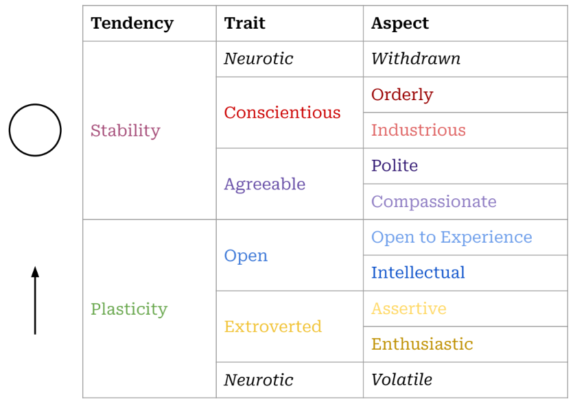
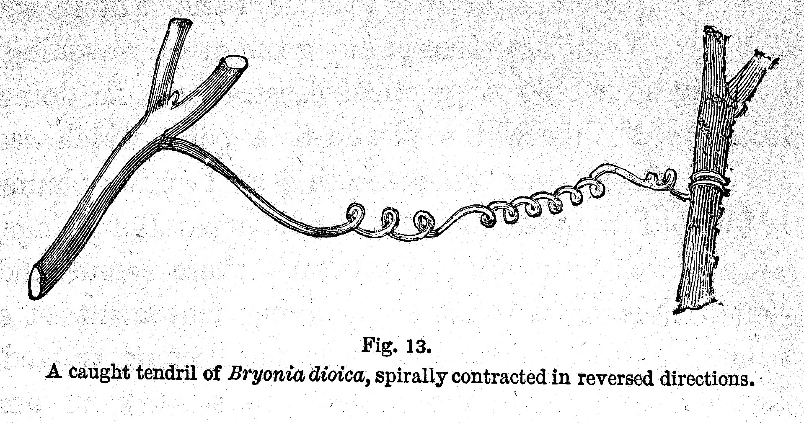
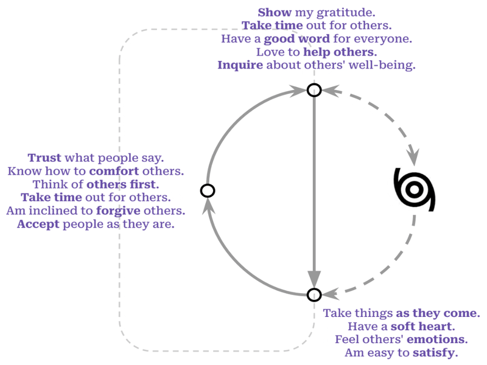

```{r message=FALSE, warning=FALSE, echo = FALSE}
library(tidyverse); library(readxl)
knitr::opts_chunk$set(echo = F, warning = F, message = F)
```


The days revolve.  I wake again into myself.  I walk the familiar orbit of habits and tensions tracing back to my childhood.  To my parents, to their childhoods. And so on.  *Life is a circle.* 

The days slip away.  I'll never see yesterday again, and I continually tiptoe on the verge of another undiscovered moment.  *Life is a line.*^[The line doesn't need to be straight: it's a motion outward, leaving stability and balance for exploration.]  
    
Circle, line: neither seems quite right, so we fuse them to depict our experience.  Change is possible, but the new can only grow from the old.  Each adult is formed from a child.  Tomorrow I will still be me, but I can unlock the closed cycle of my habits and choose what is good.  Recognizable, but transformed. *Life is a spiral*.
    
It's morning again, and I shuffle through the small deck of questions I've nearly worn out with partial answers:  [Who am I?](#who) [What do I want to become?](#what) [How do I change myself?](#how)  What do the answers hint?  That this impulse to become beautiful and good is real, knit into the fabric of our bodies and minds.

## Who am I? {#who}

### A Little World in Motion

Though there is one reality, we each walk around in our 'own worlds.' "*I am a little world made cunningly / Of elements and an angelic sprite*" writes John Donne,^[See [Holy Sonnet 5](https://www.poetryfoundation.org/poems/44108/holy-sonnets-i-am-a-little-world-made-cunningly)] gesturing toward our smallness and our vastness, our physicality and what is intangible in us.  Even that intangible part of us seems to be composed of reflections: we are mirrors of the world.^[As one of Donne's contemporaries notes, the "*mind a mirror is of heavenly sights, / A brief wherein all marvels summed lie*".  See [Look Home](https://www.poetry.com/poem/31924/look-home) by Robert Southwell.]  

__Many great traditions have addressed this question.__  Our daily round, circulating between inner and outer worlds, is a dance that has been depicted by philosophies and religions across cultures and ages: Atman and Brahman^[अयम् आत्मा ब्रह्म
*ayam ātmā brahma*, roughly translated "the self is connected to the deep foundation of reality", from the [Brihadaranyaka Upanishad 4.4.5](https://archive.org/details/Brihadaranyaka.Upanishad.Shankara.Bhashya.by.Swami.Madhavananda/page/712/mode/2up). The Upanishads also include the notion that all creatures are connected to this deep foundation, (सर्वं खल्विदं ब्रह्म, *sarvam* *khalvidam* *brahma*), see [Chandogya Upanishad 3.14.1](https://archive.org/details/upanishads01ml/page/48/mode/2up)], the knower and the known, I and Thou [@buberThou2000], the individual soul and the Empyrean^[For Dante, entering heaven can be seen as approaching this unity between self and other: "*In this flash of insight, all “I”s are one: each is everything and nothing. This was the revelation experienced by Moses on Mount Sinai, which prompted him to tell the Israelites: “I AM sent me to you.”*". [@moevsMetaphysicsDanteComedy2005], p. 31].

<!-- Make it personal -->

__It is written in our biology, our bodies.__  In *A Foray into the Worlds of Animals and Humans*, @jakobvonuexkullForayWorldsAnimals2010 describes how the internal world of any organism, including humans, is made up.  He names this subjective world an Umwelt (*surroundworld*) since it is focused outward, created and reshaped by each of us when we interact with reality. A simple picture shows how it works in action:

{width=80%}

__Each person unites the inner and outer world.__  The *Umwelt* model explains a lot, and simply. It pares down the bewildering array of experience into two realms: *inside* of me, and *outside* of me. In it, all experiences are shown as pathways between the inner world and outer reality: the narrow routes by which we *sense* the outer world (coming in), and by which we *affect* it (going out).  This loop describes all our relationships with others: we listen and speak, we take and give.

<!-- Make it personal -->

__We grow in place, within limits.__  Staggering as our experiences are, they move through us along this simple path.  The path is not a closed circle, endlessly playing the same loop over and over again: it's more like a spiral.  The world changes and calls me to change.  Sunsets may be the same as when I was a kid, but I *sense* them differently.  I change myself, and even the ungovernable world, a little bit at a time.

<!-- Make it personal -->

__We can grow into beauty, or diminish.__  The spiral is an elegant fusion of circle and line,  repetition and transformation.  And I can change for better or for worse; we acknowledge this when we talk about a *vicious cycle* (or its more recent sibling, the *virtuous cycle*).^[While it seems that early usage of 'vitious cycle' goes [back to 1608](https://english.stackexchange.com/questions/375811/origin-of-vicious-circle-and-vicious-cycle), both terms began to be used more widely only in the 20th century, [according to Google Ngram Viewer](https://books.google.com/ngrams/graph?content=virtuous+cycle%2Cvicious+cycle&year_start=1800&year_end=2019&corpus=en-2019&smoothing=0)]  A spiral is vicious when it seals me into an inner world, antagonistic to others.  It is virtuous when it beckons me out to gather, learn from, and share with others.

<!-- Make it personal -->

__I have a choice of how I grow.__  The world rushes in and I have a choice, moment-by-moment, day-after-day.  The process is difficult, and sometimes tedious, but it has real implications.  And if a little change is possible each time I move through this cycle, then a question presents itself: what is the shape I want to make?  

What are some of the the shapes that other people trace as they experience the world, make choices, and act on them?

<!-- Make it personal -->

### Same Differences
  
No one else has the same story as me.  Down to the spelling of my genetic code, I'm unique.  But others' stories resonate with me.  Even my body is written with the same language as yours: we're the same.

The collection of traits that my family, friends and colleagues recognize as 'me' describes patterns of interactions they've had with me.  Those patterns are the various ways that I interact with the world, my own specific remix of the kinds of interactions that others have with the world.

I'll use examples from my life since I have them at hand, not because they're particularly laudable or exemplary.  It comforts me to know that I'm only one slice from the broad spectrum of personhood.^[While there are certainly some unhealthy patterns, it's important to start by saying that beauty and health exist within a range, and that we are not trying to optimize personality to meet some secret combination lock of what is 'best'.]

__We engage the world through patterns of action, called traits.__ Over time, people have classified the ways in which humans interact with the world, from the ancient models of the *four humors*^[Echoes of the four humors come down into modern science, as in the work of Hans Eysenck (1916–97). "If one crosses Eysenck’s extroversion–introversion dimension with the emotional stability emotional lability dimension, four cells emerge that correspond to the Greek model of Hippocrates and Galen", according to @dumontHistoryPersonalityPsychology2010] or the *triguna*^[For a crosswalk of Indian Ayurvedic models and modern psychology, see: @srivastavaConceptPersonalityIndian2012] to modern neuropsychology.  One of the more recent versions of this effort has resulted in trait models of personality.^[See [@dumontHistoryPersonalityPsychology2010], p. 150] Beginning with the available stock of phrases available in our speech and writing, researchers have investigated whether the various descriptions we apply to each other can be distilled to a handful of common traits transcending cultures and languages.  This way, descriptions such as "she is dutiful" and "she is diligent" and "she is detail-oriented" might all be seen as pointing to an underlying character trait of "conscientiousness."  A trait is a repeated pattern which reveals how you interpret the flow of sensations and react to them.  For example, if you typically react to the flow of sensations from a crowded party with enthusiasm, you're displaying a trait we call *extroversion*.  If you shy away from asserting yourself at the party, you're exhibiting the flip side of that trait (i.e. *introversion*).  The table below gives a simplified take on how these two sides of a single trait would navigate the same scenario (i.e. a party):

|                  |                  Introverted|                  Extroverted| 
|:-----------------|----------------------------:|----------------------------:|
|__Sensing__       |               "It's so loud"|   "Great music. Who's here?"|  
|__Choosing__      |"How long do I need to stay?"|"Who should I talk to first?"|  
|__Effecting__     |             "I'm taking off"|                 "Hey there!"|

Shyness was a gravity that formed me as I grew up. The exuberant confidence I seemed to observe among my peers had no echo in me.  So I had a couple options: either I could linger on the periphery of the social sphere, hoping to be let in by a compassionate insider, or I could go off and develop my own worlds in private.  

I did both. My heart vacillated, yearning to be accepted by others and fascinated with the creative discovery which solitude allowed.  *Will the next kid run headlong at my link in the Red Rover chain to signal me out as weak?  Will the batter smack the ball out here to left field and catch me daydreaming?*  I made a few deep connections and hoped that these connections would keep me in the tribal alliances of children. *Was I invited to the sleepover just because Jonathan's mom felt bad for me?*  I wanted to be surrounded by people, but invisible.

__For all our differences, our personalities align across a few dimensions.__  No matter how lost I believed I was in my feelings, there were others who felt the same way. Even in my own school, there were kindred personalities. It's an acrid, humorous irony: so many lonely people within arms' reach of one another.  With so much in common, and so much to discover.

Generations of researchers have located five or maybe six basic dimensions which explain the incredible variety of personalities that we encounter in others.^[The two most popular trait models are known as the Five-Factor Model (FFM) and HEXACO.  The FFM uses the acronym OCEAN as a mnemmonic for the traits: *Openness to Experience*, *Conscientiousness*, *Extroversion*, *Agreeableness*, and *Neuroticism*.  HEXACO itself is an acronym, and adds an additional trait of *Honesty-Humility* to the other five, which it renames as: *Emotionality*, *eXtroversion*, *Agreeableness* (versus Anger), *Conscientiousness*, and *Openness to Experience*.]  Of course people are intricate, layering traits to produce different resonances. Even more, these layered traits interact with different environments in different ways, leading to a nearly infinite flowering of distinct persons. Each person is unique, yes, but our differences can be plotted along these same few dimensions, just as the plenitude of giraffes, tsunamis, books, and radiolarians all live within four observable dimensions of time and space. 

Complicating my own tilt toward introversion is the dimension of *agreeableness*.  While extroversion has to do with how one draws energy, this trait describes *how* we engage with others: whether I am cooperative, polite, trusting, kind, affectionate, empathetic.  Growing up, much of the social sphere struck me as artificial, and when others were unkind to me, I began to resent those arbitrary rules and find them oppressive.  I eschewed the formality of *politeness* and social norms, but continued to long for compassion.  I wanted others to feel my feelings with me, and I found myself attuned to each facial expression that my classmates made.  Maybe it started as a way to check others' approval of me, but what I saw in their curl of their lips and the creases of their eyes were deep, internal worlds: pain and hope like my own.  This compassion also rooted my nervous system to the stories I grew up with in Christianity.  The golden rule taught there didn't seem like a social norm but a revelation, more like the law of gravity.

Awkward in the spotlight of others' attention, when I feel empathy it can be tempting to distance myself or fabricate a false harmony before issues are truly resolved.  Hardwired to the facial expressions of others, I often rush to resolve that pain.  Knowing this weakness in myself, I have belatedly come to value the politeness which annoyed me when I was younger, to see structures and mores as a collective platform for compassion, delaying enemies' momentary wincing or roars by bringing them together at the same table.

The interplay between personality traits is a continual balance, often tense.  Introversion may want to lean on the strictures of politeness, but compassion tugs me back again and again into the charged arena of relationships.  Maybe someday the various urges in me will be aligned, but until then the tension between these traits is a grace, pulling me from stagnation into a virtuous circle. When I'm 'curved in upon myself', to use the phrase of St. Augustine, there are many arcs to escape the gravity of this curve: curiosity, social expectations, compassion.  I restlessly switch between these orientations until I can latch onto something stable, outside of myself.

__Our personalities are rooted in our bodies.__  Of course, if our descriptions point to something real about us, it would be strange if we couldn't trace their presence within the fabric of our bodies. Delving deeper, neurological studies [@alkalayBiologicalBasisFFM2022] have discovered relationships between our longstanding descriptions of ourselves, and the material 'stuff' which makes us up: the brain and other nerves that weave us together.

The Stoic philosophers^[See Zeno of Citium, as quoted in Diogenes Laertius' [Lives of the Eminent Philosophers](https://penelope.uchicago.edu/Thayer/E/Roman/Texts/Diogenes_Laertius/Lives_of_the_Eminent_Philosophers/7/Zeno*.html#87), who "was the first (in his treatise *On the Nature of Man*) to designate as the end "life in agreement with nature" (or living agreeably to nature), which is the same as a virtuous life, virtue being the goal towards which nature guides us."] suggest that we recognize and consciously accept the material design of the cosmos, and the constraints which it places on us.

My personality is rooted in my body, and can't be untangled.  Did my shyness lead me into social situations that produced chemicals similar to those of depression? Or was I born with a body chemistry which predispose me towards being depressed?  Where are the edges of my personality?^[See the essay *Form, Substance, and Difference*, collected in @batesonStepsEcologyMind1999]  Is it in my skin, in my senses or in the traces I leave by interacting with the world?^[In *Form, Substance, and Difference*, Bateson observes that "The mental world—the mind—the world of information processing—is not limited by the skin" (p. 461), and that the boundary of the mind varies depending on the behavior we are trying to explain, so "if...you are trying to explain...a given piece of behavior, such as the locomotion of the blind man, then, for this purpose, you will need the street, the stick, the man; the street, the stick, and so on, round and round. But when the blind man sits down to eat his lunch, his stick and its messages will no longer be relevant—if it is his eating that you want to understand." (p. 466) [@batesonStepsEcologyMind1999]]

My body moves about and takes the bruises of my habits: eyes wrinkled by concentration, liver fattened by immoderation, legs muscled from exploration. While we might display the personality as a simple five-sided shape, it lives in the curls and winding of our guts, the watery lightning of our brains.  

__They have a spiral shape.__  Distilling personality traits down, we find two basic tendencies: *stability* and *plasticity*.^[For the original study deriving these meta-traits from a community survey, see: [@deyoungHigherorderFactorsBig2006]. Later studies such as [@alkalayBiologicalBasisFFM2022], indicate that *stability* is based in the FTI Serotonin system (i.e. cautious/norm compliant), while *plasticity* is based in the dopamine and related norepinephrine system (i.e. curious/energetic).] A motion which holds us together, and a motion that impels us to explore the world.  A circle and a line.^[Identifying these two basic gestures is not the same as engaging in the cliché that there are "two types of people".  There is no utterly 'plastic' person and no utterly 'stable' person. Neither could survive. It is only in the middle space of these tendencies, in their balance, that equilibrium is found. ]

{width=80%}

The table above shows how these two tendencies play out across the five factors of personality, as well as the essential aspects [@deyoungFacetsDomains102007] which comprise those factors.  There are many more descriptions clustered under each of these, but this list gives a sense of the space in which our temperaments situate themselves.  This tension is crucial, valuing coherence (*in the circle of stability*) and also the need for movement (*in the line which jolts us toward change*).

Of the two personality factors which allow for plasticity, *extroversion* and *openness*, one is focused on affecting the world and the other is focused on sensing the world. We need these tendencies in order to grow, and we need the other factors to balance that growth. Without that balance, a person would become unstable, glutting themselves on experiences and then seek to influence others to generate new experiences, with no accountability or self-control.

For some people, extroversion is the lever that pushes them out of the rut of stability. I honor this, and frequently wish that I was oriented more towards extroversion.  For me, though, change tends to come through the route of *openness to experience*.

{width=80%}

I can feel the tug of plasticity almost tangibly sometimes: headed into depression, midwinter, or even in the middle of a situation. An existential claustrophobia. I am moving around a closed circle, or stuck in the boxes of my calendar appointments. Trapped by the stability produced by *conscientiousness*, by tacitly *agreeing* with various social pacts, I long to explore.  Sometimes a bit of reading is enough, and sometimes I want to wake up on another side of the planet.   These inclinations can lean toward escapism, though my motivation is slightly different: not to escape myself, but to rekindle my sense that each thing is open to possibility.

When I have *conscientiously* divvied up my days into tasks, the world can come to seem all surface: a series of closed lids and locked doors. If I *can* find a way to open those doors, mundane objects or activities become suffused with wonder. While it is not quite extroversion, the doors of reality most often open through the form of a living human person who breaks down the walls of my habitual sight.  

Reality coaxes us out of ourselves and into relationship, seeking acceptance, meaning, beauty.  By reaching out, toward deeper engagement with others, we also reach up, toward greater perspective and wisdom.  This spiral motion describes the ascent of kestrels, the growth of seedlings,^[@darwinPowerMovementPlants1881] and the progress of apprentices.^[I find deep sympathies between the later work of both Dante and Darwin, and how each circles back to descriptions of spirals: Dante in the curling hierarchies of the *Commedia*, and Darwin in his descriptions of the circumnutating movements of seedlings in *The power of movement in plants*.  Their visions seem rooted in a common revelation: the fundamental principle of structure and growth, whether material or spiritual.  Even after being exiled from political life (for Dante), or publishing the widely discussed and influential *Origin of Species* (in Darwin) each settled down to ponder this intuition, an echo below time and cultures.]

```{r eval=FALSE, include=FALSE}

# https://ipip.ori.org/newIndexofScaleLabels.htm

traits <- read_excel("data/TedoneItemAssignmentTable30APR21.xlsx") 

factors <- traits %>% filter(instrument == "NEO5-20")

tst <-
  factors %>%
  select(text, factor = label, key) %>%
  left_join(
    traits %>% 
      filter(instrument != "NEO5-20") %>% 
      select(text, aspect = label),
    by = "text"
  ) %>%
  filter(key == 1)

# Stack df and present as sunburst/treemp

```

### Traits as Tools

__It's important to hold onto these categories lightly.__  While it is always tempting to see our ideas about reality as reality itself, our ideas are tools: much like telescopes or microscopes.  These help us to see at different levels of resolution, and trait models help us to see behavior patterns by zooming out and viewing them in context.  But these models must continually be tested in our day to day lives: they are tools.  Even the terms used to label traits (*Open, Conscientious, Extroverted, Agreeable, Neurotic*) are fleeting, though they point to a more durable structure that underlies human persons. The accuracy of a specific word erodes as quickly as language and culture changes,^[See [@dumontHistoryPersonalityPsychology2010], p. 346: "we can never be certain what a specific hypothetical construct means, as it is always in evolution... Whenever a society has difficulty describing what is signified by the semantic label for a construct (say, love, or curiosity, or honesty) developing a measure for it is challenging."] and the specific labels used for these factors were plucked from a large array of similar terms.^[[@dumontHistoryPersonalityPsychology2010], p. 177, states that different "researchers have chosen other terms to characterize... factors. Because each higher order factor is extracted from representations of numerous traits that have more specificity than the factor does, we are faced with a problem of nomenclature. It is not a simple matter to choose a name for a factor that neither over-specifies that factor nor privileges one aspect of the dimension more than other more important aspects of it."]  For that reason, it is helpful to understand the types of descriptions which underlie these higher level factors. Having a small set of shared terms is helpful to guide our discussion, but I need to remember that "a map is not the territory"^[See Korzybski's [Science and Sanity](http://esgs.free.fr/uk/art/sands-sup3.pdf)], and that "all models are wrong, [though] some are useful."^[See @boxEmpiricalModelbuildingResponse1987, p. 424]  Reality can't be reduced to the words and tools we use to approximate it.

__I am not reducible to my traits.__  A downside of thinking about oneself as a bundle of traits is that it gives a false sense that these are fixed: that these traits "identify" me, or "add up to" me, rather than describing patterns of my interactions with the world.  We may take some comfort in being part of a group, but this same consolation can make us feel justified in forming sects, dividing us unnecessarily from others.  "*Extroverts don't understand us: they're just wired differently.*"  Similarly, a trait can easily become an excuse, if we see it as inflexible: "*I couldn't possibly talk to that suffering person, I'm an introvert.*"  There's a voice in us that objects to walls being set up arbitrarily,^["*Something there is that doesn't love a wall, / That wants it down.*" writes Robert Frost in [Mending Wall](https://www.poetryfoundation.org/poems/44266/mending-wall), and this applies at least as much to mental walls as physical ones.] a voice that insists "*I too am not a bit tamed, I too am untranslatable.*"^[Yes, my inner voice sometimes takes the form of Walt Whitman.]

__Traits are tools for navigating one's relationship with the world.__^[This is similar to the approach taken by the [StrengthsFinder](https://www.gallup.com/cliftonstrengths/en/253715/34-cliftonstrengths-themes.aspx) system, though that approach urges people to "focus on their strengths" rather than having to endure the pain of refining their weaknesses.  That is to say, it is a tool for business, not for self-transformation.]  Each trait shapes our sense of the world, and provides us with tools to impact our environment.  And we combine each trait with others, to form a comprehensive, complementary approach to the shifting situations we find ourselves in.^[Systems like the Enneagram or the Myers-Briggs try to find a single label which distills a person's characteristics into a type by combining multiple traits into a single label.]

```{r make_gif, eval=FALSE, include=FALSE}
library(gifski)
png_files <- c("images/umwelt_agreeable.png","images/umwelt_openness.png","images/umwelt_extraversion.png")
gifski(png_files, gif_file = "images/umwelt_traits.gif", width = 800, height = 600, delay = 10)
```

<!-- {width=80%} -->

<!-- Make it personal -->

__Our tools shape us in return.__  Sensing the world in a way which is compassionate or curious engraves a particular shape in us.^[In the diagrams shown here you can see specific items from the [International Personality Item Pool (IPIP)](https://ipip.ori.org/index.htm) which are associated with the traits of Agreeableness, Open mindedness, and Extroversion.  These are mapped to the specific steps in the functional circle of the Umwelt: sensing, choosing, effecting.]  That engraved pattern, in turn, disposes us to see the world in certain ways: *hopeful*, *manipulative*, *compassionate*, etc. Once the pattern is engraved, it is self-reinforcing, so we must purposefully guide our traits if we want to change their course.^[After all, some actions that are beautiful and admirable, but never occur to me because they do not fall within the cycle of my habits, my environment or my tools. For instance, taking care of premature infants in a hospital. This idea never seriously occurs to me when I make my checklist for the day, but I have friends who do it and I admire them with an awe that one might reserve for a wild elk.]

<!-- Make it personal -->

### One Among Many

__But why would I want to change anyway?  To find a place among others.__  Considering the question "[who am I?](#who)" one hears that same question echoing in each person we encounter, building toward a collective question "Who are we?"  Our little diagram above shows  us as open-ended.  We pour our actions into the world and we do not know how they will return.  We are vulnerable to the world and this has led us to run, to seek shelter, and sometimes to venture sacrifices in hopes that the world will return what we pour into it. We are utterly dependent on the world outside of us and on each other. 

<!-- Make it personal -->

__A complete picture of me includes a picture of those around me.__ It seems silly just to draw my own traits circling around. They only make sense within the flowing ecosystem of others actions, perceptions and communications. After all, these surroundings formed me in the first place.  The "outer world" is comprised of infinite inner worlds: each person in each car, at each subway stop, on each sidewalk; the inner worlds of spiders in a corner, of a mouse within your walls.  If we zoom in on the storm of the outer world, it is actually a cloud of inner worlds; a cloud of perspectives that we will never be able to stand within, but which we honor nonetheless.  My thoughts must bow to the reality of you, since "the best gesture of my brain is less than / your eyelids’ flutter which says / we are for each other."^[See e.e. cummings' [since feeling is first](https://poets.org/poem/feeling-first).  This impulse of honor is echoed in the Eastern Orthodox practice of censing and bowing to each member of the congregation, or the Hindu greeting *namaste*, which can be translated as "the sacred in me salutes the sacred in you."].

__We are for each other.__ As I think of who I am (compared to who I want to be) the domain of the social comes clearly into view. We are a social sort of creature, defining ourselves by our relationships and by where we fall within those relationships.  While this may begin out of self-interest,^[See, for example, Gregg Henrique's claim that "social influence, defined as the capacity to influence others' actions in accordance with one's interests, is a resource humans are motivated to acquire" in [@henriquesInfluenceMatrix2011] ] relationships require reciprocity. If we are defined by our relationships then we are also undefined by them. That is to say, we can only strengthen our relationships if we erode our boundaries. Think of old lovers who confuse each other's hands for their own,^["*I don’t know any other way to love,/ except in this form in which I am not nor are you,/ so close that your hand upon my chest is mine*", [Love Sonnet XVII](https://www.poetryfoundation.org/poems/49236/one-hundred-love-sonnets-xvii) by Pablo Neruda.] whose perceptions have become mingled because their defenses have been let down. Relationships are our end, in multiple senses: both our goal and our undoing. 

<!-- Make it personal -->

<!-- Add transition -->
