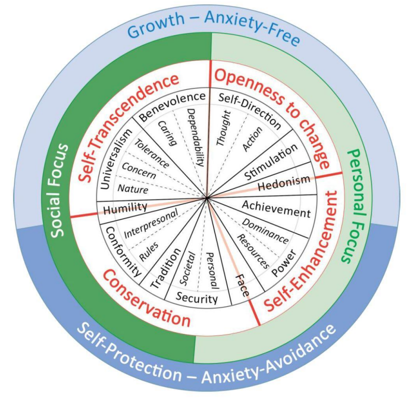

I stand at the familiar threshold, peering out from the doorway connecting my small, inner world with the clamorous beauty of Reality.  It makes me want. It accentuates those aching pockets within me that we have become accustomed to call *longing*, forgetting the strangeness of that phrase.  "Longing, we say, because desire is full / of endless distances", as Robert Hass speculates.^[In his vulnerable [Meditation at Lagunitas](https://www.poetryfoundation.org/poems/47553/meditation-at-lagunitas), which ends with the mantra "*blackberry, blackberry, blackberry*"]

This desire coaxes me to change... something... about myself, my situation.  Tiny changes are possible each time I move through the cycle of sensing, choosing and acting on the world. If I want to be purposeful in shaping these interactions, it certainly helps to have a clear understanding of myself, the patterns of behavior we call traits.  Yet I'm still left with a larger question: What do I want my patterns to change *into*?

## An inventory of desires

Rather than start by considering a small set of pre-defined 'virtues' and harboring a suspicion that something is being hidden from us by a morality we don’t share, let's begin by pulling together the broadest set of things that people value, without initially labeling them as either 'good' or 'bad'.

A helpful ally in this effort is the research of Shalom Schwartz, whose theory of values provides common terms for a full range of human interests.^[These can include both charitable and selfish ends: because the list is descriptive and not prescriptive, it includes items that have historically been known as 'virtues' and 'vices'.] His theory and associated measurement tools^[These include various versions of the *Portrait Value Questionnaire*, including the brief version used the European Social Survey.  See: @schwartzRepositorySchwartzValue2021] have been used across various subsequent psychological studies, which allow us to consider values within discussions about personality traits, group cooperation, and other relevant areas.

__Values are broad goals that guide our lives.__ According to Schwartz,^[@schwartzMeasuringRefinedTheory2022] values are "trans-situational goals, varying in importance, that serve as guiding principles in the life of a person or other social entity."  Individual people can have values, but so can communities, organizations, or other groups. 

Below is the full list of values defined in this model, with simpler terms in the first column which I intend to use throughout the subsequent discussion:^[The shorter name is followed by the longer one provided by Schwartz, and the definition drawn directly from [@schwartzMeasuringRefinedTheory2022]]

| Value          | SVS Term                   | Definition         | 
|----------------|----------------------------|--------------------|
| Dependability  | Benevolence-Dependability  | Being a reliable and trustworthy member of the in-group | 
| Caring         | Benevolence-Caring         | Devotion to the welfare of in-group members |
| Non-Judgment   | Universalism-Tolerance     | Acceptance and understanding of those who are different from oneself |
| Justice        | Universalism-Concern       | Commitment to equality, justice, and protection for all people |
| Cosmos         | Universalism-Nature        | Preservation of the natural environment |
| Humility       | Humility                   | Recognizing one’s insignificance in the larger scheme of things |
| Restraint      | Conformity-Interpersonal   | Avoidance of upsetting or harming other people |
| Conformity     | Conformity-Rules           | Compliance with rules, laws, and formal obligations |
| Tradition      | Tradition                  | Maintaining and preserving cultural, family, or religious traditions |
| Others' Safety | Security-Societal          | Safety and stability in the wider society |
| Personal Safety| Security-Personal          | Safety in one’s immediate environment |
| Appearance     | Face | Security and power through maintaining one’s public image and avoiding humiliation |
| Resources      | Power-Resources            | Power through control of material and social resources |
| Dominance      | Power-Dominance            | Power through exercising control over people |
| Achievement    | Achievement                | Personal success through demonstrating competence according to social standards |
| Pleasure       | Hedonism                   | Pleasure and sensuous gratification for oneself |
| Stimulation    | Stimulation                | Excitement, novelty, and challenge in life |
| Free Action    | Self-Direction-Action      | The freedom to determine one’s own actions |
| Free Thought   | Self-Direction-Thought     | The freedom to cultivate one’s own ideas and abilities |

The brilliance of this model is that all values are laid out in a circular continuum, so that each blends into the next.  This means that values which are next to each other on the continuum are more highly correlated.  For instance, if you value *conformity* to rules, you are more likely to also value cultural *tradition*.  Values that are opposite each other on the wheel are less related; so that people valuing *conformity* are less likely to value *free action*.

{width=80%}

I love this chart, because everything human is here: the petty conniving for power, the fear for your children's safety, the striving for freedom, the savoring of wine and chocolate, the rites and celebrations.  It shows the various directions in which we are tugged.  What keeps us awake at night, whether from thrills or fears.  The vectors of our longings.

<!-- Even while filling out the *Portrait Value Questionnaire*, I am aware of at least two ways to read and frame the question. The phrase "it is important to" could mean either that I actively feel and behave as though they are important, or it could imply that I believe it is important for people to do this in general: that the world would be a better place, if we all behaved in such a way. The latter reading begins to tilt in the direction of virtues. -->
