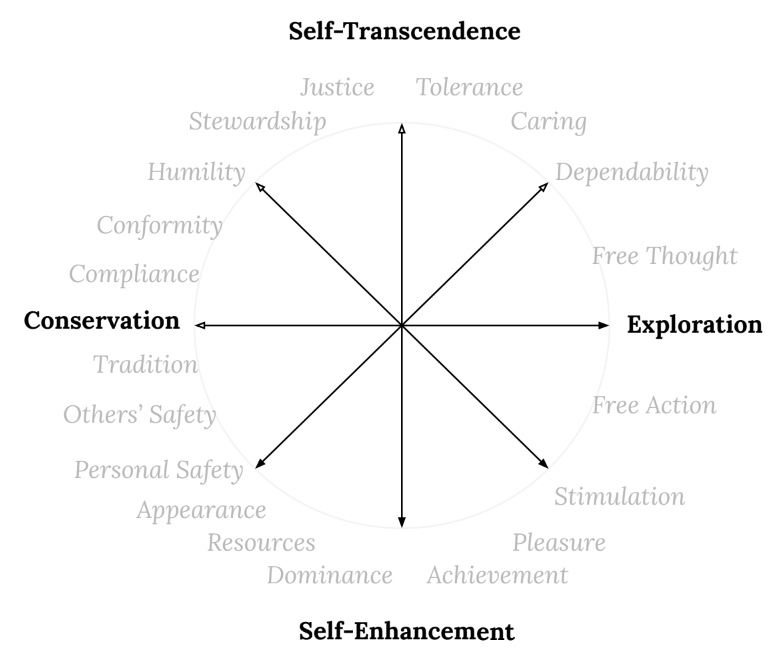

Sometimes I feel I am only this minuscule threshold, where a small self peers onto the clamorous beauty of Reality: a threshold characterized by *want*.  Sensing vastness accentuates the gaps that are within me, resounds through me with an echo we have come to call, strangely, *longing*.  "Longing, we say, because desire is full / of endless distances", as Robert Hass tells it.^[In his vulnerable [Meditation at Lagunitas](https://www.poetryfoundation.org/poems/47553/meditation-at-lagunitas), which ends with the mantra "*blackberry, blackberry, blackberry*"]

This longing coaxes me to change... something... about myself, my situation.  I know that tiny changes are possible each conscious moment, every time I move through the cycle of sensing, choosing and acting on the world. To purposely shape this cycle, it helps to have a clear understanding of the personality, the patterns of behavior we call traits.  Yet I'm left with a larger question: What do I want my patterns to change *into*?^[Or, put another way: What is at the other end of my longing?] People want a lot of things, some good and some bad.  I want to want whatever will lead to flourishing for me and those I love.

## A map of longing

__The whole territory.__  Recalling my own litany of desires (some wholesome, some not so) won't be particularly helpful. I may never have purely grasped the end of that thread that will lead to my flourishing.  Better to piece together a picture from the collective longings of others.

When Aristotle sketches out the various routes people take toward well-being, he often appeals to the common sense of speech, observing things like: "those with this trait are called..." or "this trait is uncommon, as shown by the fact that we lack a word for it."  He enlists his own observations of human behavior and keen eye for classification in the search for what we might consider a *map of longing*.

I like to think that Aristotle would enjoy current research into human values, and see it as a cross-cultural and statistically-equipped extension of his own investigations. It has asked many people many questions about the types of goals they have, and used factor analysis to distill a common set of directions that our longings move in.  The terms which describe these basic directions have been given distinct names and put into a scale.^[Named the Schwartz Value Scale (SVS) after its original developer, Shalom Schwartz. The scale rests on various measurement tools, including various versions of the *Portrait Value Questionnaire*.  Because these tools have been used across various subsequent psychological studies, which allow us to consider values within discussions about personality traits, group cooperation, and other relevant areas. See: @schwartzRepositorySchwartzValue2021]  This scale is our best current map of human longing and (not surprisingly) it echoes words that we have used across centuries and cultures to discuss what we want to become. 

What I've been calling a desire, a longing, a goal, the scale refers to as a 'value'.  These values are intended to include the full range of directions that humans use to chart their courses.  Because the list is descriptive and not prescriptive, it includes items that have historically been known as virtues and vices: both 'saints' and 'sinners' wander through this map.

__Values are broad goals that guide our lives.__ Or, put a bit more specifically, they are "trans-situational goals, varying in importance, that serve as guiding principles in the life of a person or other social entity".^[@schwartzMeasuringRefinedTheory2022]  Individual people can have values, but so can families, communities, organizations, or other groups. 

Below is the full list of values defined in the Schwartz Value Scale (SVS), with simpler terms provided in the first column, which I intend to use in this discussion moving forward:^[The shorter name concocted by me is followed by the longer one provided by Schwartz, and the definition drawn directly from [@schwartzMeasuringRefinedTheory2022]]

| Value          | SVS Term                   | Definition         | 
|----------------|----------------------------|--------------------|
| Dependability  | Benevolence-Dependability  | Being a reliable and trustworthy member of the in-group | 
| Caring         | Benevolence-Caring         | Devotion to the welfare of in-group members |
| Non-Judgment   | Universalism-Tolerance     | Acceptance and understanding of those who are different from oneself |
| Justice        | Universalism-Concern       | Commitment to equality, justice, and protection for all people |
| Cosmos         | Universalism-Nature        | Preservation of the natural environment |
| Humility       | Humility                   | Recognizing one’s insignificance in the larger scheme of things |
| Restraint      | Conformity-Interpersonal   | Avoidance of upsetting or harming other people |
| Conformity     | Conformity-Rules           | Compliance with rules, laws, and formal obligations |
| Tradition      | Tradition                  | Maintaining and preserving cultural, family, or religious traditions |
| Others' Safety | Security-Societal          | Safety and stability in the wider society |
| Personal Safety| Security-Personal          | Safety in one’s immediate environment |
| Appearance     | Face | Security and power through maintaining one’s public image and avoiding humiliation |
| Resources      | Power-Resources            | Power through control of material and social resources |
| Dominance      | Power-Dominance            | Power through exercising control over people |
| Achievement    | Achievement                | Personal success through demonstrating competence according to social standards |
| Pleasure       | Hedonism                   | Pleasure and sensuous gratification for oneself |
| Stimulation    | Stimulation                | Excitement, novelty, and challenge in life |
| Free Action    | Self-Direction-Action      | The freedom to determine one’s own actions |
| Free Thought   | Self-Direction-Thought     | The freedom to cultivate one’s own ideas and abilities |

__These values are related to each other.__  The brilliance of this model is that all values are laid out in a [circular continuum](https://www.ncbi.nlm.nih.gov/pmc/articles/PMC9131418/figure/fig1-1073191121998760/), so that each blends into the next.  This means that values which are next to each other on the continuum are more highly correlated.  For instance, if you value *conformity* to rules, you are more likely to also value cultural *tradition*.  Values that are opposite each other on the wheel are less related; so that people valuing *conformity* are less likely to value *free action*.

{width=80%}

So much that is human is here, distilled into the naive simplicity of a diagram: the petty conniving for power, the fear for your children's safety, the striving for freedom, the savoring of wine and chocolate, the rites and celebrations.  It shows the various ways we are tugged, and what keeps us awake at night, whether from thrills or fears.  The great loom on which our longings are woven.

__Values shape us as we reach for them.__  *Achievement*, *safety*, *justice*... these are not things that we can attain once and for all, but aspire to.  Their fullness always seems to lie just beyond our reach.  Yet they shape us even now, these visions we reach toward, as the light through the forest canopy shapes a sapling.

__But can we choose what we reach for?__  Can we change what we value and shape ourselves into something new?  If the values arrayed around this circle shade into one another, then it is possible for us to move our affections from one value to another. Perhaps I can choose a different light to lean toward, taking my current jumble of desires and aligning them, re-orienting them.  Do I value being *dependable*, but think that *caring* is a higher calling?^[A quick note on the tools used for the Schwartz Values Scale: Even while filling out the *Portrait Value Questionnaire*, I am aware of at least two ways to read and frame the questions it asks. The tool prompts respondents to "read each description [of an imagined person] and think about how much that person is or is not like you" and then proceeds with a number of statements with the form "It is important to him/her to...".  When filling the questionnaire out, the phrase "it is important to" could mean either that I actively feel and behave as though they are important, or it could imply that I believe it is important for people to do this in general: that the world would be a better place if we all behaved in such a way. The former reading is helpful for uncovering my shortcomings, while the latter begins to tilt in the direction of virtues.]  I may want to re-orient my desires.

## Focus on flourishing

__Paring down the list.__  Out of the whole array of values which we could hold, we have to choose some and not others.  After all, many are in tension, or even conflict, with each other (it's hard to value both conformity and free action, for instance).  So if it's possible to choose what we value, how will we make the choice?

__In with the good, out with the bad.__ We can start with a most basic impulse, at the root of everything from our healthcare regimens to our religious rituals: the principle of "in with the good, out with the bad."^[On the subject of religious rituals, Jane Ellen Harrison writes that from the earliest examples, rites have concerned themselves with the "riddance of whatever is conceived to be hostile, and the enhancement of whatever is conceived of as favorable to human life". See: [@harrisonEpilegomenaStudyGreek2017]]  Our goal is to embody what is good and remove what is bad, leaving just good stuff.  I’ll follow Aristotle and call this state "flourishing".

### Flourishing together

Before we begin to call some values generally beneficial (or "healthy") and others generally detrimental (or "unhealthy"), it's important to answer "Beneficial *for whom*?"  After all, I can do many things that benefit me, but harm others or neglect them.

__It has to work for others, too.__ I'm going to move forward with a definition of flourishing that is communal, one which seeks rescue from individualism and "the shipwreck of the singular."^[The phrase is George Oppen's, from his masterful serial poem *Of Being Numerous*, where he defines the stance of modern-day truth-seekers as: "Obsessed, bewildered / By the shipwreck / Of the singular / We have chosen the meaning / Of being numerous." @georgeoppenSelectedPoems2003]

Aspiring to flourish as a community, beyond the narrow vessel of the individual "self", is a principal which should orient human life. There is reason enough to adopt such a principal based on its prevalence across religious and cultural traditions, though one could just as easily make a claim for the evolutionary benefits of such an approach.

__We need each other.__ Once we move beyond "bare survival" (*i.e. zero-sum games*), cooperation allows communities to flourish.  It permits strategies such as improvisation, cultural transmission, and collective tools and rules.^[According to @curryMappingMoralityCompass2019a, "Natural selection can favour genes for cooperation – that is, genes for evolutionarily-stable phenotypic strategies designed to achieve superior equilibria in nonzerosum interactions – and has done throughout the history of life."  The highly social disposition of human beings has "made it possible for humans to attempt to improve upon natural selection’s solutions by inventing evolutionarily-novel solutions – ‘tools and rules’ – for further bolstering cooperation."]

All of which is another way of saying "I am not enough."  I rely on others for my existence, and I want give back; I long to become something which crests above the bounds of the "tiny my-ness"^[To use the term Milosz uses, in the poem of that name. @miloszUnattainableEarth1987] I was given at birth.  It's as though I was granted this self as a ladder, to climb up its rungs and into a wider world: to transcend it.

__Our senses point beyond our separate selves.__  All of the values listed above can, at least indirectly, be faint gestures toward this transcendence. Even the inclination toward physical pleasure (what Schwartz labels *hedonism*) may appear self-centered, but contains an erotic longing beyond myself.^[Aristotle disses this longing for contact as the least refined sensual pleasure, saying that "the licentious enjoy the delight that comes about entirely through *touch*, in food, drink, and the matters said to belong to Aphrodite", but it can equally be seen as our desire, however misled, to feel beyond our skin. @aristotleAristotleNicomacheanEthics2012]  After all, when we really inspect its boundaries, the lines between myself and my surroundings is blurry at best.  My survival, and flourishing, expands beyond my body into community, culture, ecosystem.^[The early cyberneticist Gregory Bateson's mind-and-life-bending essay *Form, Substance, and Difference* traces a compelling argument that "the mental world — the mind — the world of information processing — is not limited by the skin" and then lays out the implications of this insight.  @batesonStepsEcologyMind1999]  With collective flourishing in mind, let's consider whether some types of values or broad goals will tend to bring us nearer.

## Remove the bad

As much as we may chafe at characterizing commonly held values as “less-than” others, in practice we do this all the time.  Imagine a job interview where the prospective candidate announced that their primary values were dominance over others and doing things that brought them pleasure.  Or, imagine a friend calling to tell you “I've met someone and we want to get married.  I think it's a perfect match: he values his own appearance a lot and needs to be continually stimulated in order to stay interested.”  It seems clear enough that not all values lead equally to collective flourishing.

__There are dark behavior patterns.__ In psychological research, certain behavioral patterns have been identified as running contrary to this goal.  These patterns have been given a suggestive name: the Dark Triad (or Tetrad).^[The "Dark Triad" refers to the malevolent and anti-social personality traits of *Machiavellianism* (treating other people as a means to achieve one's own ends), *narcissism* (obsession with oneself and belief that you are superior to others), and *psychopathy* (lack of empathy and willingness to exploit others).  More recent studies have expanded this to a "Dark Tetrad", adding *sadism* (deriving pleasure from the pain or discomfort of others) to the list.]

The use of the metaphor "dark" is worth dwelling on for a moment, since it points back to a old stock of images.  The association of "darkness" with evil seems entwined with our bodies' biological sense, which is to say, with our *umwelt*.  The poem "One More Day"^[@miloszUnattainableEarth1987] puts it emphatically: 

> should we discredit the idea for its modest origins?  
> Or should we say plainly that good is on the side of the living  
> And evil on the side of a doom that lurks to devour us?  
> Yes, good is an ally of being and the mirror of evil is nothing,  
> Good is brightness, evil darkness, good high, evil low,  
> According to the nature of our bodies, of our language.  

An action associated with "darkness" is a retreat from others and the world into a self-contained loop (i.e. a 'vicious cycle').^[When historical cultures have chosen to depict untrustworthy or diabolical characters, they often depicted them as crooked or hunched over. While those with congenital issues have suffered unjustly from these depictions, the images provide a physical form for a pattern of behavior.]  When Augustine sought to sum up the peculiar infirmity of the human species, he said that we were "curved in on ourselves": *homo incurvatus in se*.   Current research into dark personality patterns seems to agree.

__Are certain values or traits "dark"?__  Various studies have investigated the relationship of the dark triad to both personality traits and values.  We could think of personality traits as our inherited "nature" and the values as the learned "nurture" associated with these behavioral patterns.^[This is the simplified approach offered by @olverPersonalityTraitsPersonal2003.  I say 'simplified', because it seems that values may also have a genetic component, as hinted at in @schermerBehaviorGeneticStudy2011]  Based on this body of research, "dark" values are those which place oneself above others, rather than pursuing what is good for the broader community.^[[@perssonDarkValuesDark2015] write that "high scorers on the Dark Triad hold values that entail the exclusion of others and the enhancement of oneself" (p. 10), and that "what makes the Dark Triad 'dark' is not some latent evilness but a value system (i.e., focused on agentic/selfish outcomes) that is inconsistent with most people’s value systems (i.e., focused on pro-social outcomes)" (p. 3).]

### Dark values

So which values tend toward darkness?  

_Darkness is a movement toward self-enhancing values._  These values include pleasure, stimulation, achievement, resources, dominance^[According to [@perssonDarkValuesDark2015], these appear to be the 'common core' of dark tendencies: "Hedonism, Stimulation, Achievement, and Power appear to be the primary values held by those high on the Dark Triad traits." (p. 5)  Since their study used the older version of the SVS, I've unpacked "power" into its two components from the later, expanded version found in [@schwartzMeasuringRefinedTheory2022]], and appearance.^[Although the value of *face*, which I've re-named *appearance*, didn't enter into the SVS until after some of the studies we're referencing, there seems to be reason to include it based on the work of @truhanManyFacesDark2021.  There, it appears in relationship to narcissism in the term "acclaim-seeking" (p. 25)]  The table below summarizes the values associated with *dark triad* personality profiles, as well as which profiles embrace those values:

| Value | SVS | Dark Trait |
|-------|-----|------------|
| Stimulation | Stimulation | Machiavellianism, Narcissism, Psychopathy |
| Pleasure | Hedonism | Machiavellianism, Psychopathy |
| Achievement | Achievement | Machiavellianism, Narcissism, Psychopathy |
| Dominance | Power (Dominance) | Machiavellianism, Narcissism, Psychopathy |
| Resources | Power (Resources) | Machiavellianism, Narcissism, Psychopathy |
| Appearance | Face | Narcissism |

A value is a consistently-made choice.  So, as darkness gravitates toward the values above, it  also tends away from a number of other values.

__Darkness is a move away from self-transcending values and communal traditions.__  Not surprisingly, it swerved clear of values such as Dependability, Caring, Non-Judgment, Justice, Cosmos^[In both [@perssonDarkValuesDark2015] and [@kajoniusHedonismAchievementPower2015], the tables and graphs reporting zero-order correlations and standardized regression weights for the Dark Triad and Schwartz’s value types show significant negative relationships with the values of *benevolence* and *universalism*. Since these studies used the older version of the SVS, I've unpacked these into their respective components from the later, expanded version found in [@schwartzMeasuringRefinedTheory2022]], and Humility.^[Although the value of *humility* didn't enter into the SVS until after some of the studies we're referencing, there seems to be reason to include it based on [@djeriouatDarkTriadPersonality2014].  That study notes that the "Dark Triad-moral utilitarianism link is negatively mediated by... Honesty/Humility personality factor" (p. 7).]  Interestingly, darkness also eschews the value of tradition, disregarding collectively-developed conventions in favor of self-selected ones.^[[@perssonDarkValuesDark2015] found that "Tradition... showed particular impact by the Dark Triad... This effect likely exemplifies the high scorer on the Dark Triad: showing disregard for conventions, bordering on anti-social behavior" (p. 9).]

__Darkness uses other people as disposable tools.__  It sees them as means toward an end, rather than as ends in themselves.^[[@kajoniusHedonismAchievementPower2015] describes this inclination  by saying that "'Dark values' are associated with manipulating people and viewing other people as a means towards selfish gains" (p. 6).]  Because of this, it typically views others through the lens of their "use value", rather than as being intrinsically valuable.^[The intriguing study by [@djeriouatDarkTriadPersonality2014] posits that "Dark Triad traits relate to utilitarian inclinations because of the lack of empathy and of a low preoccupation about the welfare of others, which is inconsistent with the promotion of aggregate well-being" (p. 4).  It also includes the somewhat damning finding that: "Neuroscience research has revealed that patients with damage to the ventromedial pre-frontal cortex(vmPFC) show a greater preference for utilitarianism in moral judgments (Koenigs et al., 2007). Reduced connectivity in vmPFC is a neurobiological characteristic of clinical psychopaths (see Motzkin, Newman, Kiehl, & Koenigs, 2011)" (p. 3).]

__Dark values combine to form a tangled web.__  As if to reinforce the maxim "what a tangled web we weave", the structure of dark traits has recently been analyzed to show its structure.^[See [@truhanManyFacesDark2021]]  Darkness appears to be a network of mutually reinforcing traits, where self-centeredness and antagonism to others combine with indifference, detachment, superiority, manipulation, thrill-seeking and other factors to form patterns that are harmful to collective life.  The interplay of these negative patterns is reminiscent of what has been thoughtfully identified and warned against by many spiritual manuals over the centuries.^[I'm thinking specifically of the nuanced thicket of vices which is charted out in St. John Climacus' *Divine Ladder of Ascent*, which pragmatically acknowledges that disentangling oneself from negative patterns of thought is a necessary prelude to seeking illumination.  See:  @saintjohnclimacusLadderDivineAscent1982]

__Not all values are either dark or opposed to darkness.__ Before we are tempted to draw a line which separates all values into a battle of 'good vs. evil', it's worth noting that darkness has an ambiguous relationship with some values, especially free thought and free action.  This makes intuitive sense, because you can choose to act and think in a way that either harms or benefits others.  Darkness also doesn't seem to have a particularly strong relationship with valuing safety, whether others' safety or that of you and your own family.  This also seems intuitive, since safety is a basic need, yet is commonly used to justify harm to others and piling up resources unfairly.

We've seen that people's darker tendencies move away from certain values, but there are reasons to prefer those values beyond the mere fact that they are "not bad".  Being motivated simply by a set of "do not's" has never been easy for me. 

## Keep the good

There are many reasons to pursue what is good and beautiful, but in keeping with the approach I've tried to take so far, I'll be relying mostly on sociological and psychological research.^[Admittedly, social science is a latecomer to  areas of basic human concern, so it often echoes sentiments from poets, philosophers, and spiritual teachers, and sometimes I can't help but bring those voices in to humanize the more "systematic" approach.  While I think the case made by these studies provides a clarity that is beautiful on its own terms, it seems foolish to refuse the insights of more mature traditions of inquiry.]

A couple of influential recent theories suggest that moral rules provide us with an evolutionary advantage, helping communities to navigate complicated coordination problems.  The first of these is *Moral Foundations Theory*, which seeks to undo some of the Enlightenment and colonial-era thinking about morality by simply asking people from a wide array of cultures and social classes to define it.^["The first step in mapping the moral domain of any culture, we believe, should therefore be to list and count the norms that get the most attention. What norms and norm violations do people gossip about? What norms are broken and punished in myths and folk tales? When people reject or criticize other members of their community, or when they express shock at the practices of another community, which norms are involved?" in @haidtMoralMindHow2008 (p. 7)] As a result, they identified five areas of moral concern, which could be clearly linked to adaptive challenges of a social creature such as humans, and which elicited clear moral emotions across multiple cultures. ^[[@haidtMoralMindHow2008] documents "five sets of concerns, each linked to an adaptive challenge and to one or more moral emotions..." and shares that "the five foundations we identified are harm/care, fairness/reciprocity, ingroup/loyalty, authority/respect, and purity/sanctity."]  These 'moral foundations' are: (1) care for others, (2) fairness, (3) loyalty to group, (4) respect for authority, and (5) purity/sanctity.

The other theory, *Morality-as-Cooperation*, seeks to explain why we call certain actions good by imagining that the function of morality is to promote cooperation.  It calls out several common types of cooperation: (1) sharing resources with family, (2) coordinating for mutual advantage, (3) social exchange, (4) resolving conflict through bravery, (5) resolving conflict through respect, (6) dividing resources, and (7) owning resources.^[See @curryMappingMoralityCompass2019a, which lists the areas of cooperation as "(1) the allocation of resources to kin (Hamilton, 1963); (2) coordination to mutual advantage (Lewis, 1969); (3) social exchange (Trivers, 1971); and ... conflict resolution through contests featuring displays of (4) hawkish and (5) dove-ish traits (Maynard Smith & Price, 1973); (6) division (Skyrms, 1996); and (7) possession (Gintis, 2007)."]

The table below shows which values are more likely to lead to cooperation and collective flourishing, based on these theories and studies based on them:

| Value            | SVS                           | MAC          | MFT               |
|------------------|-------------------------------|--------------|-------------------|
| Dependability    | Benevolence (*Dependability*) | Mutualism    | Ingroup           |
| Caring           | Benevolence (*Caring*)        | Reciprocity  | Care, Fairness    |
| Non-Judgment     | Universalism (*Tolerance*)    | *N/A*        | *N/A*             | 
| Justice          | Universalism (*Concern*)      | Fairness     | Fairness          |
| Cosmos           | Universalism (*Nature*)       | *N/A*        | *N/A*             |
| Humility         | Humility                      | *N/A*        | *N/A*             |
| Restraint        | Conformity (*Interpersonal*)  | *N/A*        | *N/A*             |
| Conformity       | Conformity (*Rules*)          | Deference    | Authority, Purity |
| Tradition        | Tradition                     | Deference    | Authority, Purity |
| Others' Safety   | Security (*Societal*)         | Kin altruism, Mutualism, Reciprocity | Ingroup, Fairness |
| Personal Safety  | Security (*Personal*)         | *N/A*        | Purity            |
| Resources        | Power (*Resources*)           | Property     | *N/A*             |

